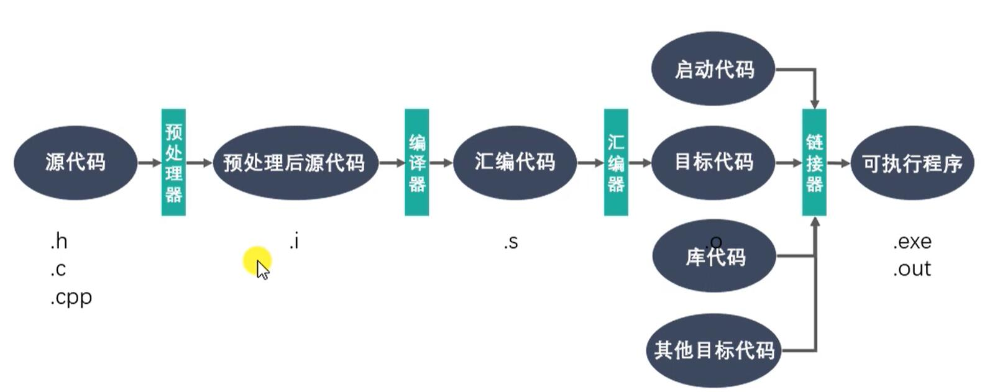
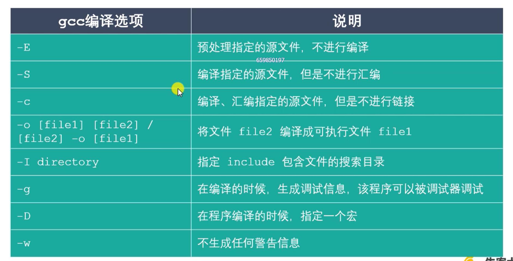
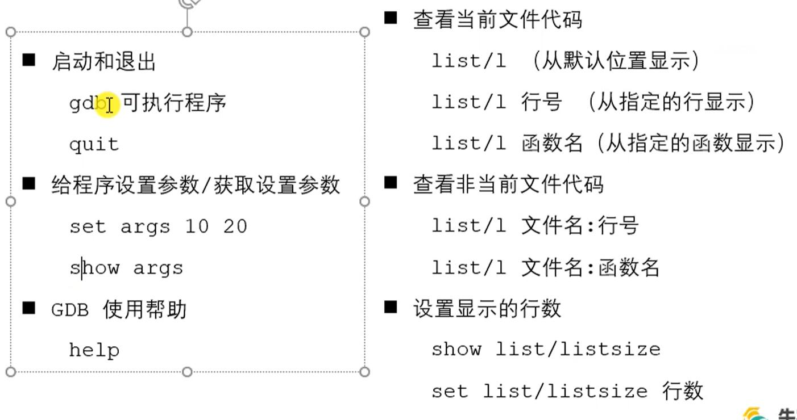
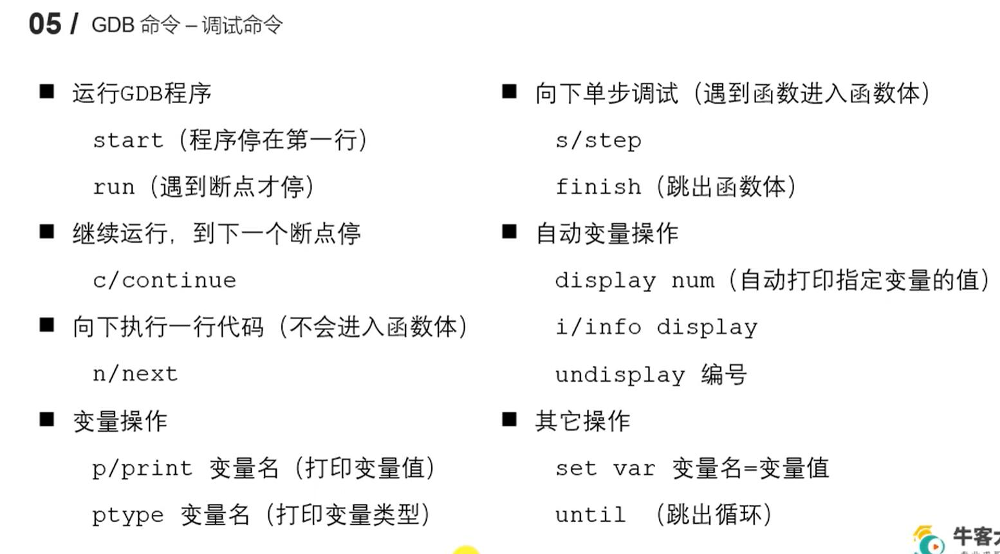

# 了解linux

## gcc

- `gcc test_gcc.c -E -o test.i` 预处理
- ` gcc test.i -S -o test.s` 编译为汇编代码
- `gcc test.s -s -o test.o` 






- -D 就类似这种
  ```c
  #ifdef MYDEFINE
    printf("kjahsdka");
  #endif
  ```

## 静态库

库的好处: 1. 代码保密 2. 方便部署和开发
静态库在链接阶段被复制到程序中

### 静态库的制作

- 命名规则: 
  - linux: libxxx.a
  - windows: libxxx.lib
- 制作 
  - gcc 获得 `.o` 文件
  - 将 `.o`文件打包, 使用ar工具(archive)
    - `ar rcs libxxx.a xxx.o xxxxx.o xxxx.o`
    - r -将文件插入备存文件中
    - c -建立备存文件
    - s -索引


### 静态库的使用

`gcc main.c -o app -I ./include -l cal -L ./lib` 
- -I 查找 `#include`里面的文件
- -l 添加库  libcal(省略lib) -L 去哪找这个库

## 动态库

动态库在链接阶段没被复制到程序中,而是程序在运行时由系统动态加载到内存中供程序调用

### 动态库的制作和使用

- 命名规则: 
  - linux: libxxx.so
    - 在linux下是一个可执行文件
  - windows: libxxx.dll
- 制作
  - gcc 得到 .o文件, 得到和位置无关的代码
    - gcc -c -fpic/-fPIC a.c b.c
  - gcc 得到动态库
    - gcc -shared a.o b.o -o libcalc.so

- 使用 `gcc main.c -o app -I ./include -l cal -L ./lib`  
  运行出现了错误`./main: error while loading shared libraries: libcal.so: cannot open shared object file: No such file or directory`


### 动态库加载失败的原因

- `ldd ./main` 列出动态库依赖关系 `list dynamic dependencies`
  

定位共享库的位置


### 解决动态库加载失败问题

根据上图的搜索顺序
- 可以添加到环境变量里
  - `exprot LD_LIBRARY_PATH=$LD_LIBRAY_PATH:`
  - `pwd` 显示当前目录
  - 只有一次有效
- 永久配置环境变量
  - 用户级别: 修改用户目录下的 `.bashrc`文件, 末尾加上 `export 啥啥`, 然后cmd输入 `source .bashrc`
  - 系统级别: `sudo vim /etc/profile`, 加上`exprot啥`, 然后source一下 

### 静态库和动态库对比

- 静态库的优缺点
  - 优点
    - 静态库被打包到应用程序中加载速度快
    - 发布程序无需提供静态库, 移植方便
  - 缺点
    - 消耗系统资源,浪费内存
    - 更新部署发布麻烦
- 动态库优缺点
  - 优点
    - 可以实现进程间资源共享
    - 更新部署发布简单
    - 可以控制何时加载动态库
  - 缺点
    - 加载慢
    - 发布时需要提供依赖的动态库

### makefile

自动化编译
make命令默认只执行第一条规则
1. 命名 makefile/Makefile
2. 规则 一般其他规则都是为第一条规则服务的
3. 工作原理
   1. 执行命令前,检查规则中的依赖是否存在
   2. 检查更新,在执行规则中的命令时, 会比较目标和依赖文件的时间(依赖是否需要重新生成)
4. 变量
5. 模式匹配
    `%.o:%.c`
6. 函数
   1. wildcard
   2. patsubst替换获取`.o`文件
7. 伪目标 `.PHONY:clean` 之后就不会和外面对比了(工作原理2, 检查更新)

 
### GDB
功能
  - 启动程序
  - 让程序在指定断点处停下(断点可以为表达式)
  - 当程序被停住时,可以检查此时程序的状态
  - 可以改变程序, 将一个BUG产生的影响修正从而测试其他BUG
2. 使用
    编译时加 `-g`, 然后 `gdb main`
3. 命令设置参数就是cmd里面给的那个
4. 断点
5. 调试