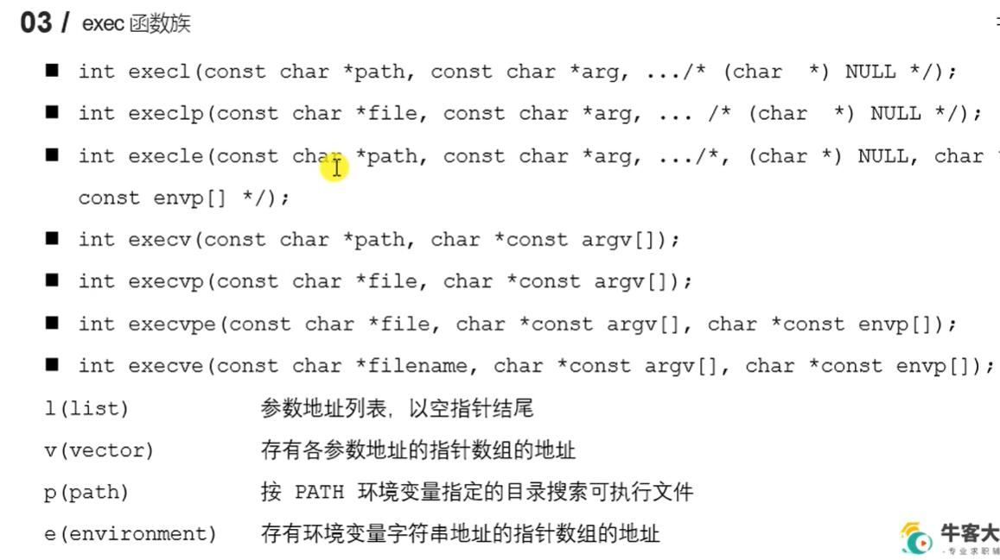
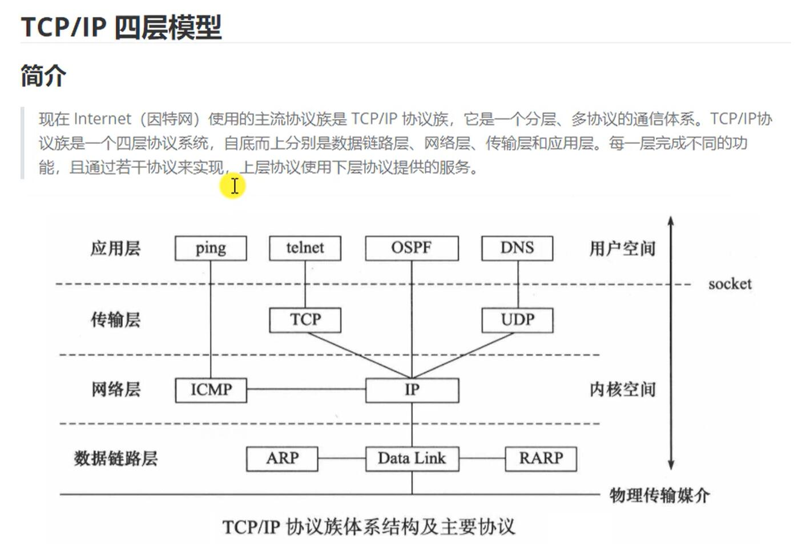

[TOC]


函数指针  =&myfunc  还是 =myfunc

# 了解linux
运行进程的时候加个 `&` 表示在后台运行 (后台进程)
可以再输入 `fg` 切换回前台执行(前台进程)
## gcc

- `gcc test_gcc.c -E -o test.i` 预处理
- ` gcc test.i -S -o test.s` 编译为汇编代码
- `gcc test.s -s -o test.o` 


- -D 就类似这种
  ```c
  #ifdef MYDEFINE
    printf("kjahsdka");
  #endif
  ```

## 静态库

库的好处: 1. 代码保密 2. 方便部署和开发
静态库在链接阶段被复制到程序中

### 静态库的制作

- 命名规则: 
  - linux: libxxx.a
  - windows: libxxx.lib
- 制作 
  - gcc 获得 `.o` 文件
  - 将 `.o`文件打包, 使用ar工具(archive)
    - `ar rcs libxxx.a xxx.o xxxxx.o xxxx.o`
    - r -将文件插入备存文件中
    - c -建立备存文件
    - s -索引


### 静态库的使用

`gcc main.c -o app -I ./include -l cal -L ./lib` 
- -I 查找 `#include`里面的文件
- -l 添加库  libcal(省略lib) -L 去哪找这个库

## 动态库

动态库在链接阶段没被复制到程序中,而是程序在运行时由系统动态加载到内存中供程序调用

### 动态库的制作和使用

- 命名规则: 
  - linux: libxxx.so
    - 在linux下是一个可执行文件
  - windows: libxxx.dll
- 制作
  - gcc 得到 .o文件, 得到和位置无关的代码
    - gcc -c -fpic/-fPIC a.c b.c
  - gcc 得到动态库
    - gcc -shared a.o b.o -o libcalc.so

- 使用 `gcc main.c -o app -I ./include -l cal -L ./lib`  
  运行出现了错误`./main: error while loading shared libraries: libcal.so: cannot open shared object file: No such file or directory`


### 动态库加载失败的原因

- `ldd ./main` 列出动态库依赖关系 `list dynamic dependencies`
  

定位共享库的位置


### 解决动态库加载失败问题

根据上图的搜索顺序
- 可以添加到环境变量里
  - `exprot LD_LIBRARY_PATH=$LD_LIBRAY_PATH:`
  - `pwd` 显示当前目录
  - 只有一次有效
- 永久配置环境变量
  - 用户级别: 修改用户目录下的 `.bashrc`文件, 末尾加上 `export 啥啥`, 然后cmd输入 `source .bashrc`
  - 系统级别: `sudo vim /etc/profile`, 加上`exprot啥`, 然后source一下 

### 静态库和动态库对比

- 静态库的优缺点
  - 优点
    - 静态库被打包到应用程序中加载速度快
    - 发布程序无需提供静态库, 移植方便
  - 缺点
    - 消耗系统资源,浪费内存
    - 更新部署发布麻烦
- 动态库优缺点
  - 优点
    - 可以实现进程间资源共享
    - 更新部署发布简单
    - 可以控制何时加载动态库
  - 缺点
    - 加载慢
    - 发布时需要提供依赖的动态库

## makefile

自动化编译
make命令默认只执行第一条规则
1. 命名 makefile/Makefile
2. 规则 一般其他规则都是为第一条规则服务的
3. 工作原理
   1. 执行命令前,检查规则中的依赖是否存在
   2. 检查更新,在执行规则中的命令时, 会比较目标和依赖文件的时间(依赖是否需要重新生成)
4. 变量
5. 模式匹配
    `%.o:%.c`
6. 函数
   1. wildcard
   2. patsubst替换获取`.o`文件
7. 伪目标 `.PHONY:clean` 之后就不会和外面对比了(工作原理2, 检查更新)


## GDB
功能
  - 启动程序
  - 让程序在指定断点处停下(断点可以为表达式)
  - 当程序被停住时,可以检查此时程序的状态
  - 可以改变程序, 将一个BUG产生的影响修正从而测试其他BUG
2. 使用
    编译时加 `-g`, 然后 `gdb main`
3. 命令设置参数就是cmd里面给的那个
4. 断点
5. 调试


## linux文件

### 标准C库IO函数和linux系统IO函数对比

跨平台实现: java虚拟机, C调用系统API
标准C库带有缓冲区, linux自带IO无缓冲区

### 虚拟地址空间


### 文件描述符

PCB里面存在一个文件描述符表


### linux系统IO函数

- open
  int open(const char* pathname, int flags);
  int open(const char* pathname, int flags, mode_t mode);
  打开文件  open.c

  创建文件 open.c/ceate()
    **这里和umask不符**

- read/write
  ssize_t read(int fd, void *buf, size_t count);
  ssize_t write(int fd, const   void *buf, size_t count);
- lseek
  c语言库里为fseek
  off_t lseek(int fd, off_t offset, int whence);
  作用: 
  1. 移动文件指针到头文件 lseek(fd, 0, SEEK_SET)
  2. 获取当前文件指针的位置  a = lseek(fd, 0, SEEK_CUR)
  3. 获取文件长度 len = lseek(fd, 0, SEEK_END)
  4. 拓展文件长度, 比如增加100字节, (当前是10) lseek(fd,100, SEEK_END), 比如下载的时候, 先拓展占用位置, 然后慢慢下载
  写一个`" "` 就从10 变成 110了, (见 `hello.txt`)
- stat/lstat 
  linux还有 `stat`这个命名: 查看文件信息
  int stat(const char *pathname, struct stat *statbuf)
  int lstat(const char *pathname, struct stat *statbuf)
  
  

### 文件属性操作函数
`file_property.c`  
int access(const char* paathname, int mode);
  - 判断某个文件是个否有mode指定的权限
  - mode取值: R_OK W_OK X_OK F_OK(是否存在)

int chmod(const char* filename, int mode);
  - 修改文件权限
  - mode取值: 具体查看`man 2 chmod`

int chown(const char* path, uid_t owner, gid_t group);
int truncate(const char * path, off_t length);
  - 缩减或扩展文件的大小


### 目录操作函数
`filedir.c`  

int mkdir(const char* pathname, mode_t mode);

int rmdir(const char* pathname);

int rename(const char* oldpath, const char* newpath)

int chdir(const char* path);
  - 修改进程的工作目录  

char* getcwd(char *buf, size_t size);
  - 获取当前工作路径


### 目录遍历函数 

`man 3 opendir`  
DIR *opendir(const char* name);
struct dirent *readdir(DIR *dirp);
int closedir(DIR *dirp);

### dup dup2函数
- int dup(int oldfd) : 复制一个新的文件描述符
  从空闲的文件描述符表中找一个最小的, 作为新的拷贝的文件描述符, 两个文件描述符指向同一个文件
- int dup2(int oldfd, int newfd)
  用指定的newfd(必须有效)指向oldfd指向的文件, 重定向文件描述符


### fcntl
int fcntl(int fd, int cmd, .../*arg*/)
  - 复制文件描述符
  - 设置/获取文件的状态标志  
     #include <unistd.h>  
     #include <fcntl.h>

       int fcntl(int fd, int cmd, ... /* arg */ );
    - 参数 cmd
      - F_DUPFD : 复制文件描述符 int ret = fcntl(fd, D_DUPFD)
      - F_GETFL : 获取文件状态flag
      - F_SETFL : 设置


# linux多进程开发

## 进程

在传统的操作系统中, 进程既是基本的分配单元, 也是基本的执行单元

内核数据结构
  - 进程相关的标识号(IDs)
  - 虚拟内存表
  - 打开的文件描述符
  - 信号传递及处理的有关信息
  - 进程资源使用及限制
  - 当前工作目录等 


- 进程可以使用的资源上限(可用`ulimit -a`查看)


### 进程状态切换
新建态,就绪态,运行态,阻塞态(wait/sleep),终止态


- 显示进程信息 指令`ps`
  `ps aux`
  - 表头
    - tty : 当前进程所属的终端
    - STAT状态
    - command : 什么命令产生的进程
    `ps ajx`
    - PPID: parent process ID
    - PGID: process group ID
    - SID : 会话ID(例: 多个group组成一个会话)

- 动态显示进程 `top`
- `kill` 杀死进程
  - `kill [-signal] pid`
  - `kill -l`列出所有信号
  - `kill -SIGKILL pid`强制干掉
  - `kill -9 pid`强制干掉

### fork
改的 : 
- pid,ppid 
- 返回值rax
- 信号集

fork()通过 **写时拷贝(copy-on-write)** 实现.写时拷贝可以推迟甚至避免拷贝数据的技术.
内核此时并不复制整个进程的地址空间,而是让父子进程共享同一个地址空间.即资源的复制只有在需要写入的时候才会进行,在此之前都是以只读方式共享

fork产生的子进程与父进程相同文件的文件描述符指向相同的文件表, 引用计数增加

 vfork - create a child process and block parent

pid_t vfork(void);


### GDB多进程调试
`hello.c`

gdb默认追踪父进程
设置 调试父进程或者子进程`set follow-fork-mode [parent|child]`
`set detach-on-fork [on|off]`调试的时候 另一个进程是否悬停在fork()

其他几个命令 
 - `info inferiors` 查看调试的进程
 - `inferiors id` 切换当前调试的进程
 - `detach inferiors id`使进程脱离GDB调试

### exec函数族  `elecl.c`
exec根据文件名找到可执行文件,并用它来取代调用进程的内容,即在调用程序内部执行一个可执行文件

**保留内核区, 但用户区直接被替换为调用函数**

返回: **执行成功不会返回**, 失败返回-1 



执行exec 

并不会出现下面那种两次终端的情况

孤儿进程会多一次终端

最后无了,
原因: 父进程已经结束运行, 子进程变为了孤儿进程
另外可以看到, 调用进程的pid = 4382 等于exec中子进程的pid, 
//但是ppid两者不一样???
 1924 是init的进程号, 见下面孤儿进程, TODO **教学里面父进程是1**


### 进程退出, 孤儿进程,僵尸进程 
- 进程退出
  
  `_exit()`不会刷新I/O缓冲区
  

- 孤儿进程
  - 父进程结束子进程还运行
  - 出现孤儿进程时, 内核会把孤儿进程的父进程设置为init, init会循环的wait()这些子进程, 
  - 孤儿进程也不会有什么危害
- 僵尸进程
  - zombie.c
  - 内核区没有释放
  - 子进程结束而父进程没有结束导致自己成内核区不能释放

### wait  waitpid
`waitdemo.c`


```c
pid_t wait(int *wstatus);
  - 成功返回子进程id
  - 失败返回-1(所有子进程结束 or  调用失败)
  调用wait会阻塞
  - wstatus  存储退出信息 

  有些退出信息宏函数, 
    - WIFEXITED(wstatus) 
    - WEXITSTATUS(wstatus)

    等等 
```

```c
pid_t waitpid(pid_t pid, int *wstatus, int options);
  回收指定进程号的子进程,可以设置是否阻塞

  - pid :
      >0 : 子进程
      =0 : 回收当前进程组的所有子进程
      -1 : 回收所有子进程(相当于wait())
      <-1: 回收某个进程组的组id, 进程组id为 -pid, 
  - ret :
      >0 子进程id
      =0 :在 option=WNOHANG下, 表示还有子进程
      =-1: 错误或者没子进程
```


## 进程间通信 (IPC)


- 匿名管道
  - 半双工
  - 只能在具有公共祖先的进程(父与子, 或者兄弟进程)之间使用
  
  为啥可以用管道进行进程间通信?
    - 亲缘进程之间的文件描述符共享
  
  数据结构
    - 环形队列


### 匿名管道通信  pipe.c


管道 默认**阻塞**

读端是 fd[0], 写端是fd[1]

一个例子 : 实现 ps aux | grep xxx  `parent-child-ipc.c`


### 管道的读写特点

1. 指向管道写端的文件描述符都被关闭了(管道写端引用计数为0), 当管道中的数据被读完后, 再read就会返回0,(类似文件EOF)
2. 没有关闭(管道写端引用计数大于0), 数据被读完后再read就会阻塞
3. 管道读端引用计数等于0(**读端都关闭**), 继续写, 该进程就会收到SIGPIPE信号, 通常导致进程异常终止
4. 读端引用计数大于0,管道满了会阻塞 


### 有名管道(FIFO)


不相关的进程也能交换数据

- 不同点
  - FIFO在文件系统中作为一个特殊文件存在,但FIFO中的内容存放在内存上
  - 当使用FIFO的进程退出后,FIFO文件将继续保存在文件系统中以便以后使用
  - FIFO有名字,不相关的进程可以通过打开有名管道进行通信


创建fifo
  - 通过命令 `mkfifo name`
    - 注意: window的文件系统不支持管道文件，只要把创建的管道文件路径设为linux的本地文件夹就行了。
  - 代码
```c
#include <sys/types.h>
#include <sys/stat.h>

int mkfifo(const char *pathname, mode_t mode);
```

/home/read.c write.c


### 内存映射
将磁盘文件的数据映射到内存,

```c
#include <sys/mman.h>

void *mmap(void *addr, size_t length, int prot, int flags,int fd, off_t offset);
/* parameters:
    - addr : NULL, choosed by kernel
    - lenth : data size, this value can't be 0(Recommended length of file)
      get length of file : stat lseek
    - prot : 对申请内存映射区域的操作权限, 要映射必须有read权限
       PROT_EXEC  Pages may be executed.
       PROT_READ  Pages may be read.
       PROT_WRITE Pages may be written.
       PROT_NONE  Pages may not be accessed.
    - flags: MAP_SHARED : 映射区数据自动和磁盘文件进行同步 
             MAP_PRIVATE:不同步
    - offset:文件中的偏移量, 必须指定为4K的整数倍(一般不用)
  return value :  success: 返回创建内存的首地址
                  failed: 返回MAP_FAILED  (void*)(-1)
*/
int munmap(void *addr, size_t length);
/*
length和mmap中的length一样


*/

```

`memmap.c  text.txt`


- 内存映射的注意事项
  - 如果对mmapdd的返回值 ptr做++操作(ptr++),munmap是否可以成功?
    - 可以++, 但会释放错误
  - 如果open时O_RDONLY,mmap时prot参数指定PROT_READ|PROT_WRITE会怎样?  
    - 错误
  - offset设置为1000?
    - 偏移量必须是4K的整数倍 
  - mmap什么时候会调用失败?
    - length=0
    - prot没有指定读权限(或者open没有设置权限)
  - 可以open时O_CREATE来建一个映射区吗
    - 可以, 但文件大小不能为0(可以通过lseek()函数拓展)
  - mmap后关闭文件描述,对mmap有没有影响?
    - 无
  - 对ptr越界怎么样?
    - 段错误

使用映射完成文件复制 `copyfile.c`


匿名映射:不需要文件实体进行一个内存映射 : `prot设置为 PROT_ANON`   `memmap.c/anonymous_map()`


## 信号
软件层次上对中断机制的一种模拟, 是一种异步通信的方式

查看系统定义的信号列表 `kill -l`


查看信号详细信息 `man 7 signal`

5种默认处理

    Term   Default action is to terminate the process.
    
    Ign    Default action is to ignore the signal.
    
    Core   Default action is to terminate the process and dump core (see core(5)).
    
    Stop   Default action is to stop the process.
    
    Cont   Default action is to continue the process if it is currently stopped.


信号的3种状态:产生, 未决, 递达

SIGKILL和SIGSTOP不能被捕捉,阻塞或者忽略, 只能执行默认动作

### 信号相关函数

signal/sigfunc.c


- 信号捕捉函数
  - #include <signal.h>
  - sighandler_t signal(int signum, sighandler_t handler);
  - int sigaction(int signum, const struct sigaction *act,struct sigaction *oldact);

### 信号集相关函数 


1. 用户通过键盘 Ctrl + C, 产生2号信号SIGINT()
2. 信号产生未被处理(未决) 
   1. 在内核中将所有的没被处理的信号存储在一个集合中(未决信号集)
   2. SIGINT信号被存储在第二个标志位(比如一共64位,000...010)
3. 未决状态的信号,需要被处理,处理之前要和另一个信号集(阻塞信号集), 进行比较
   1. 阻塞信号集默认不阻塞任何信号
   2. 想要设置阻塞信号,需调用系统API
4. 比较
   1. 没有阻塞, 信号就被处理
   2. 阻塞,这个信号继续处于未决状态,直到阻塞解除后被处理

信号相关函数 `signal/sigset.c`


`sigaction()` `signal/sigfunc.c`

内核实现信号捕捉过程


### SIGCHLD  注意是 CHLD
产生条件
  - 子进程终止
  - 子进程接收到SIGSTOP信号停止时
  - 子进程处于停止态,接收到SIGCONT后唤醒时
父进程默认忽略SIGCHLD信号

使用SIGCHILD信号解决僵尸进程问题`signal/sigchld.c`l

### 共享内存 `IPC/shm.c read_shm.c`

与管道等要求发送进程将数据从用户空间的缓冲区复制进内核内存和接收进程将数据从内核复制进用户空间的缓冲区做法相比, 这种IPC更快


- os如何知道共享内存被多少进程attach : 通过结构体stcuct shmid_ds.shm_nattach

 

- 共享内存和内存映射的区别
  - 共享内存可以直接创建,内存映射需要磁盘文件(匿名映射除外)
  - 共享内存效率更高
  - 内存
    - 所有进程操作同一块共享内存
    - 内存映射,每个进程在自己的虚拟地址空间中有一个独立的内存
  - 数据安全
    - 进程突然退出
      - 共享内存还存在
      - 内存映射消失
    - 运行进程的电脑宕机
      - 数据存储在共享内存中, 销毁了(未保存)
      - 内存映射中, 由于磁盘文件还在, 以及文件同步, 所以还在
  - 生存周期
    - 内存映射区:进程退出就销毁了
    - 共享内存:进程退出不一定, 需标记且关联进程为0,或者关机 


### 守护进程

**控制终端**:为什么程序输出到命令行?


进程组是一组相关进程的集合, 会话是一组相关进程组的集合

进程组由一个或者多个共享同一个PGID的进程组成. 一个进程组拥有一个进程组首进程, 该进程为创建该组的进程,其组ID为该进程组的ID,新进程会继承其父进程所属的进程组ID

进程组生命周期, 开始时间为首进程创建, 结束为最后一个成员退出该组(进程可能因为终止退出, 也可能以为加入别的组退出)


长时间运行, 控制终端不会为守护进程生成信号


会话组长与进程组长不能为同一个

创建守护进程  步骤: `deamon/deamon.c`
1. fork(),父进程退出,子进程继续执行
2. 子进程调用setsid()开启一个新会话(why child?避免进程组与会话id冲突)
3. 清除进程umask
4. 修改进程工作目录为 /
5. 关闭守护进程从其父进程继承而来的打开的文件描述符
6. 关闭fd 0,1,2后,守护进程通常会打开/dev/null并使用dup2()使所有这些描述符指向这个设备
7. 业务逻辑(进程功能)


# linux多线程开发


## 线程
线程共享同一份全局内存区域, 包括初始化数据段、未初始化数据段,以及堆内存段


线程是轻量级的进程(LWP:light weight process), 在linux下线程本质仍然是进程, 查看LWP号 `ps -Lf pid`

虚拟地址空间内：栈空间和.text段切割


- 线程操作函数 `thread/pthread.c`
```c
int pthread_create(pthread_t *thread, const pthread_attr_t *attr, void *(*start_routine) (void *), void *arg);
void pthread_exit(void *retval);

int pthread_join(pthread_t thread, void **retval);
```

- pthread_join / retval每次值都不一样
  - 函数里面的int a是一个局部变量, 返回的是局部变量的地址, 线程结束后, 栈被释放掉, 指针指向的值随机
  - 为什么传递二级指针??
    - 要修改 一级指针本身的值需要二级指针,即一级指针本身内容的地址, 否则就是值传递, 而非引用传递

```c
int pthread_detach(pthread_t thread);
  - 当一个分离的线程终止时会自动将资源返还给os, 而不需要其他线程的join
  不能多次 detach 线程
int pthread_cancel(pthread_t thread);
  - 取消线程(终止), 但不是立刻终止, 而是当子线程执行到一个取消点(系统规定的系统调用), 可以粗略的理解为从用户区到内核区的一个调用
```

TODO : 为什么有时候cancel输出了两次??
child 0
child 0
0
1
2
3


- 线程属性 pthread_create() 里面的attr参数
  `thead/pthread_attr.c`
  各种操作函数 `pthread_attr_*()`


## 锁
线程同步  `mutex/sellticket.c`
临界区操作
- 互斥量 `mutex`
  ```c
  pthread_mutex_t
  int pthread_mutex_init(pthread_mutex_t * restrict mutex, const pthread_lockattr_t *mutex)
  int pthread_mutex_destory(pthread_mutex_t *mutex);
  int pthread_mutex_lock(pthread_mutex_t *mutex);
  int pthread_mutex_trylock(pthread_mutex_t *mutex);
  int pthread_mutex_unlock(pthread_mutex_t *mutex);
  - restrict C语言的修饰符, 被修饰的指针不能由另外一个指针进行操作
  ```

- 读写锁 : 写是独占的, 写的优先级最高, 多个线程同时读共享资源不会导致问题
    ```c
  pthread_rwmutex_t
  int pthread_rwmutex_init(pthread_rwmutex_t * restrict rwmutex, const pthread_rwmutex_t *rwmutex)
  int pthread_rwmutex_destory(pthread_rwmutex_t *rwmutex);
  int pthread_rwmutex_rdlock(pthread_rwmutex_t *rwmutex);
  int pthread_rwmutex_tryrdlock(pthread_rwmutex_t *rwmutex);
  int pthread_rwmutex_wrlock(pthread_rwmutex_t *rwmutex);
  int pthread_rwmutex_trywrlock(pthread_rwmutex_t *rwmutex);
  int pthread_rwmutex_unlock(pthread_rwmutex_t *rwmutex);
  - restrict C语言的修饰符, 被修饰的指针不能由另外一个指针进行操作
  ```

- 生产者 消费者模型 `producer customer thread/procus.c`
对象 
  - 生产者
  - 消费者
  - 容器

- 一个小插曲  TODO ATTENTION
```c
    struct node * newnode = malloc(sizeof(struct node));
    newnode->next = curr;
    newnode->num = rand()%1000;

    curr = newnode;
    printlink(curr);

    printf("newnode   ");
    printlink(newnode);
// 这链表哪里错了????

 !!!!!    printlink 函数里修改了全局变量curr !!!!!
```

made 发现问题了, 原来是 if里面  `==` 写成了 `=`
麻了 

- 条件变量 `pthread_cond_t`
  `mutex/cond.c`
```c
      pthread_cond_wait(&cond, &m);
      pthread_mutex_unlock(&m);
// 当阻塞时,会对互斥锁解锁, 当不阻塞时会重新加锁(锁本身某些特性需要cond函数这么操作把)
```

- 信号量 `sem_t` `mutex/semaphore.c`
  ```c
  #include <semaphore.h> 
   int sem_init(sem_t *sem, int pshared, unsigned int value);
  ```

# linux 网络编程

## 网络基础知识
C/S结构
- Client:负责执行前台功能,出错提示、在线帮助,并且可以在子程序间自由切换
- Server:
- 优缺点
  - 优点:
    - 可以充分发挥客户端计算能力,所以响应速度快
    - 漂亮,个性化要求
    - C/S结构有较强的事务处理能力,能实现复杂的业务流程
    - 安全性高
  - 缺点:
    - 客户端需要安装维护等
    - 不能跨平台

B/S结构
- 优点:
  - 成本低、维护方便、分不性强、开发简单,系统拓展能力强
- 缺点
  - 通信开销大、系统和数据的安全性难以保障
  - 个性化低
  - 协议一般固定 http/https
  - 交互为 请求-响应模式,通常动态刷取界面,响应速度慢

MAC地址(Media Access Control Address), 也称为局域网地址 以太网地址 物理地址  硬件地址 **唯一**


端口类型
- 周知端口(Well Known Ports) : 0-1023,不能用
- 注册端口(Registered Ports) : 1024 - 49151
- 动态端口(私有端口) : 49152-65535 不固定分配某种业务,而是动态分配



协议
- 三要素:语法 语义 时序

## socket编程
网络中不同主机上的应用进程进行双向通信的端点的抽象
核心: ip + port

字节序
- 大小端法
- 字节序转换函数
  - 网络字节顺序采用大端法
  - ```c
    #include <arpa/inet.h>
    uint16_t htons(uint16_t hostshort)
    uint16_t ntohs(uint16_t netshort)
    uint32_t htonl(uint32_t hostlong)
    uint32_t ntohl(uint32_t netlong)
    ```


之前的结构体定义
```c
#include <bits/socket.h>
struct sockaddr{
  sa_family_t sa_family;
  char sa_data[14];
};

typdef unsigned short int sa_family_t
```
新版
```c
#include <bits/socket.h>
struct sockaddr_storage{
  sa_family_t sa_family;
  unsigned long int __ss_align

  char __ss_padding[128 - sizeif(__ss_align)];
};

typdef unsigned short int sa_family_t
```

**专用socket地址**  `struct sockaddr_in` 结构
```c
#include <netinet.in.h>
struct sockaddr_in
{
  sa_family_t sin_family;
  in_port_t sin_port;
  struct in_addr sin_addr;
  unsigned char sin_zero[sizeof(struct sockaddr) 
  -  __SOCKADDR_COMMON_SIZE - sizeof(in_port_t) 
  - sizeof(struct in_addr)];
};

```

ip地址转换
点分十进制字符串表示的ip地址和网络字节序整数表示的Ip地址之间的转换 `socket/iptrans.c`
```c
#include <arpa/inet.h>
// p 点分十进制字符串,  n网络字节序整数
int inet_pton(int af, const char* src, void *dst);
  - parameters
    - af:地址族 AF_INET AF_INET6

const char* inet_ntop(int af, const void *src, char *dst, socklen_t size);
  - size : dst指向位置的大小
  - ret : 值与dst相同
```
## TCP实现

TCP通信流程
- 服务器端
  - 创建一个用于监听的套接字
    - 监听:监听客户端的连接
    - 套接字:本质是一个文件描述符
  - 将监听的套接字和本地的IP和端口绑定
  - 设置监听, 开始工作
  - 阻塞等待,当有连接时解除阻塞,接收连接,得到一个用于通信的套接字(fd)
  - 通信
  - 断开连接
- 客户端
  - 创建一个用于通信的套接字(fd)
  - 连接服务器,需要指定连接服务器的ip和端口
  - 连接成功,通信
  - 结束,断开连接

套接字函数
```c
#include <sys/types.h>          /* See NOTES */
#include <sys/socket.h> 
// 或者直接 #include <arpa/inet.h>
int socket(int domain, int type, int protocol);
  - create a socket
  - parameters
    - domain: 协议族
       AF_UNIX,AF_LOCAL      Local communication  
       AF_INET      IPv4 Internet protocols  
       AF_INET6
    - type:通信过程中使用的协议
      SOCK_STREAM:流
      SCOK_DGRAM:报式
    - protocol: 具体的协议,一般写0 
      SOCK_STREAM : 默认tcp
      SOCK_DGRAMG : 默认udp
  ret:返回fd,失败返回-1
int bind(int sockfd, const struct sockaddr *addr, socklen_t addrlen);
  绑定fd和本地的ip+port
  - 参数
    - sockefd
    - addr : 需要绑定的socket地址
    - addr指向的内存大小
int listen(int sockfd, int backlog);
  保存请求数量的最大值
int accept(int sockfd, struct sockaddr *addr, socklen_t *addrlen);
  从listen的backlog中接收连接,默认阻塞
    - addr 传出参数,记录连接成功后客户端的地址信息(ip+port)

  - ret : 返回用于通信的文件描述符, 失败-1
write  read 
```

`tcp/server.c  client.c`


并发服务器
accept阻塞可能会被信号处理函数(软中断)破坏, 导致accept函数出错`accept: Interrupted system call`
```c
    int cfd = accept(lfd, (struct sockaddr *)&clientaddr, &addrlen);
    // accept 的阻塞被信号终止了

    if(cfd == -1){
      if(errno == EINTR0){
        continue;
      }
      perror("accept");
      return -1;
    } 
```

tcp状态转换

主动断开的一方,进入TIME_WAIT状态,持续2MSL(message Segment lifetime), 让主动方发送的ACK丢失的情况下可以重新发送ack

半关闭,端口复用
- 关闭连接时, 左边发了FIN并且右边回了ACK, 但右边没有发FIN, 这时候左边就处于半关闭状态(半连接)
- 函数
  ```c
  int shutdown(int sockfd, int how);
    - how : SHUT_RD  SHUT_WR   SHUT_WDWR
  ```
- 多个进程共享一个文件描述符时,其中有一个进程调用了shutdown(sfd,SHUT_RDWR)后,其他的进程将无法进行通信.但是调用close(fd)不会影响其他进程 

端口复用
- 防止服务器重启之前绑定的端口还未释放
- 程序突然退出而系统没有释放端口

`netstat`命令
- -a所有的socket
- -p显示正在使用socketdd的程序
- -n 直接使用IP地址,而不通过服务器名

cntl+c结束 server后, server占用的端口号仍然会持续1分钟(linux) (TIME_WAIT状态)

```c
#include <sys/types.h>
#include <sys/socket.h>

// 设置套接字属性
int setsocket(int sockfd,int level, int optname, const void*optval, socklen_t optlen);
  - level: SOL_SOCKET
  - optname: 
    - SO_REUSEADDR
    - SO_REUSEPORT
  - optval:
    - 1可以复用
    - 0不可以
  -optlen : optval的大小
在服务器绑定端口之前设置端口复用
```
## IO多路复用(多路转接)  epoll
使程序能同时监听多个文件描述符,能够提高程序的性能,linux下实现IO多路复用的API有 `select poll epoll`

传统的BIO模型(blocking)
缺点 -- 根本原因blocking
- 线程或进程消耗资源
- 线程或进程调度消耗资源

非阻塞,忙轮询


NIO模型
每循环内O(n)系统调用,n为客户端数

IO多路复用


select `epoll/select.c` 
- 构建一个文件描述符列表
- 调用一个系统函数,监听该列表,直到这些描述符中一个或者多个进行IO时返回 
  - 函数是阻塞
  - 检测操作由内核完成
- 返回时告诉进程有多少描述符要进行IO
```c

/* According to POSIX.1-2001, POSIX.1-2008 */
#include <sys/select.h>

/* According to earlier standards */
#include <sys/time.h>
#include <sys/types.h>
#include <unistd.h>

int select(int nfds, fd_set *readfds, fd_set *writefds,
          fd_set *exceptfds, struct timeval *timeout);
      - nfds:委托内核检测的最大文件描述符的值+1
      - readfds: 委托读的属性, 是一个传入传出参数
      - writefds : 不满置1
      - exceptfds: 检测异常
      - timeout: 因为函数是阻塞, 设置最大阻塞时间, 0 变送是不阻塞, null表示永久阻塞, 直到有fd变化

      - ret:-1 失败, >0(n):有n个fd发生了变化
void FD_CLR(int fd, fd_set *set);
int  FD_ISSET(int fd, fd_set *set);  // 返回 值(用于判断)
void FD_SET(int fd, fd_set *set);
void FD_ZERO(fd_set *set);

```

缺点


poll -- select的改进版 `epoll/poll.c`
```c
#include <poll.h>
struct pollfd {
   int   fd;         /* file descriptor */
   short events;     /* requested events */
   short revents;    /* returned events */
};
int poll(struct pollfd *fds, nfds_t nfds, int timeout);
  - fds 也是数组, struct pollfd的集合
  - nfds 最大下标+1, 一般为个数
  - timeout 0 不阻塞, -1阻塞, 有变化时解除  >0 阻塞时间
```

epoll
```c
#include <sys/epoll.h>
// 在内核中创建实例 struct eventpoll, 两个核心的结构 
//   - struct rb_root rbr; : 需要检测的文件描述符(rbtree)
//   - struct list_head rdlist; : 就绪列表(双向链表)
int epoll_create(int size);
  - size没意义了 , 随便写个就行 >0  
  - retval : -1 for failed, >0 : epfd : 操作创建实例的文件描述符

typedef union epoll_data {
  void    *ptr;
  int      fd;
  uint32_t u32;
  uint64_t u64;
} epoll_data_t;

struct epoll_event {
  uint32_t     events;    /* Epoll events */
  epoll_data_t data;      /* User data variable */
};
常用的 event 
  - EPOLLIN 
  - EPOLLOUT // TODO 这个是干嘛的   老是出错误 
  - EPOLLERR  
  - EPOLLET 边沿触发
int epoll_ctl(int epfd, int op, int fd, struct epoll_event *event);
  - op
    - EPOLL_CTL_ADD
    - EPOLL_CTL_MOD
    - EPOLL_CTL_DEL
  - event 具体操作
int epoll_wait(int epfd, struct epoll_event*events,int maxevents, int timeout);
  检测函数
  - events 传出函数,保存发送了变化的文件描述符信息
  - maxevents 第二个参数的大小
  - timeout 0 不阻塞  -1 阻塞 >0 具体时间(毫秒)

  retval : >0 发生变化的个数   -1 for failed
```


epoll的两种工作模式
- LT模式(level-triggered)(水平触发) `epoll_lt.c`
  - 缺省的工作方式(默认), 同时支持block和no-block socket. 在这种做法中, 内核告诉你一个文件描述符是否就绪, 然后你可以对这个就绪的fd进行IO操作. 如果不做任何操作, 内核还会通知你
- ET(edge-triggered)(边沿触发)  `epoll_et.c`
  - 高速工作方式, 只支持no-block socket. 这种模式下, 当描述符从未就绪变为就绪时, 内核通过epoll通知你. 然后内核会假设你知道文件描述符已就绪,并且不会再为那个文件描述符发送更多的就绪通知,直到你做了某些操作导致那个文件描述符重新变为未就绪. **注意, 如果一直不对这个fd做IO操作(从而导致它再次标变为未就绪), 内核不会发送更多的通知(only once)**
  - ET模式在很大程度上减少了epoll事件被重复触发的次数, 因此效率要比LT模式高. epoll工作在ET模式的时候, 必须使用非阻塞套接口, 以避免一个文件句柄的阻塞读/阻塞写把处理多个文件描述符的任务饿死


// TODO et 有点bug  明天再改   脑袋疼
